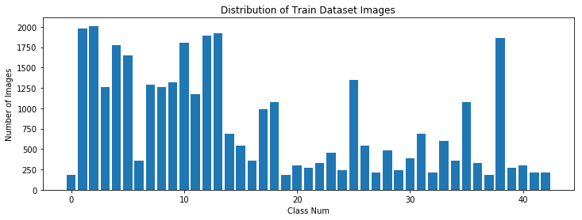
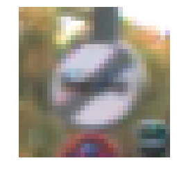
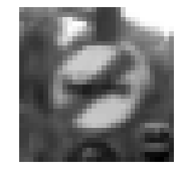
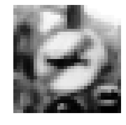

# **Traffic Sign Recognition** 

## Writeup

### You can use this file as a template for your writeup if you want to submit it as a markdown file, but feel free to use some other method and submit a pdf if you prefer.

---

**Build a Traffic Sign Recognition Project**

The goals / steps of this project are the following:
* Load the data set (see below for links to the project data set)
* Explore, summarize and visualize the data set
* Design, train and test a model architecture
* Use the model to make predictions on new images
* Analyze the softmax probabilities of the new images
* Summarize the results with a written report

[//]: # (Image References)

[image1]: ./examples/visualization.jpg "Visualization"
[image2]: ./examples/grayscale.jpg "Grayscaling"
[image3]: ./examples/random_noise.jpg "Random Noise"
[image4]: ./examples/placeholder.png "Traffic Sign 1"
[image5]: ./examples/placeholder.png "Traffic Sign 2"
[image6]: ./examples/placeholder.png "Traffic Sign 3"
[image7]: ./examples/placeholder.png "Traffic Sign 4"
[image8]: ./examples/placeholder.png "Traffic Sign 5"

## Rubric Points
### Here I will consider the [rubric points](https://review.udacity.com/#!/rubrics/481/view) individually and describe how I addressed each point in my implementation.  

---
### Writeup / README

#### 1. Provide a Writeup / README that includes all the rubric points and how you addressed each one. You can submit your writeup as markdown or pdf. You can use this template as a guide for writing the report. The submission includes the project code.

You're reading it! and here is a link to my [project code](https://github.com/udacity/CarND-Traffic-Sign-Classifier-Project/blob/master/Traffic_Sign_Classifier.ipynb)

### Data Set Summary & Exploration

#### 1. Provide a basic summary of the data set. In the code, the analysis should be done using python, numpy and/or pandas methods rather than hardcoding results manually.

I used the pandas and numpy library to calculate summary statistics of the traffic
signs data set:

* The size of training set is **34799**
* The size of the validation set is **4410**
* The size of test set is **12630**
* The shape of a traffic sign image is **(32, 32, 3)**
* The number of unique classes/labels in the data set is **43**

#### 2. Include an exploratory visualization of the dataset.

Here is an exploratory visualization of the data set. It is a bar chart showing how the data is distributed among classes. The classes are not evenly distributed, some classes have very few images others have more images.

### Design and Test a Model Architecture

#### 1. Describe how you preprocessed the image data. What techniques were chosen and why did you choose these techniques? Consider including images showing the output of each preprocessing technique. Pre-processing refers to techniques such as converting to grayscale, normalization, etc. (OPTIONAL: As described in the "Stand Out Suggestions" part of the rubric, if you generated additional data for training, describe why you decided to generate additional data, how you generated the data, and provide example images of the additional data. Then describe the characteristics of the augmented training set like number of images in the set, number of images for each class, etc.)

As a first step, I decided to convert the images to grayscale because color is not a very significant feature to look for in images in this project as most images does not have good lighting and almost similar colors. Also added advantage that with grayscale network requires fewer parameters for input and hence faster training.
Then I applied histogram equalization to standardize the lighting in all images. This also results in higher contrast in image - which in turns help in feature extraction.
Later I added normalization to the preprocessing pipeline.

Here are some example images

#### 2. Describe what your final model architecture looks like including model type, layers, layer sizes, connectivity, etc.) Consider including a diagram and/or table describing the final model.

My final model consisted of the following layers:

| Layer         		|     Description	        					| 
|:---------------------:|:---------------------------------------------:| 
| Input         		| 32x32x3 RGB image   							| 
| Convolution 5x5     	| same padding, outputs 28x28x60 				|
| RELU					|												|
| Convolution 5x5		| same padding, outputs 24x24x60				|
| RELU					|												|
| Max pooling	      	| 2x2 stride,  outputs 12x12x60 				|
| Convolution 3x3	    | same padding, outputs 10x10x30 				|
| RELU					|												|
| Convolution 3x3		| same padding, outputs 8x8x30					|
| RELU					|												|
| Max pooling			| 2x2 stride, outputs 4x4x30					|
| Dropout				|         										|
| Flatten				| outputs 480									|
| Dense					| outputs 500									|
| Dropout				| 												|
| Dense					| outputs 43									|
| Softmax 				|												|

***Total trainable params - 378,023***

#### 3. Describe how you trained your model. The discussion can include the type of optimizer, the batch size, number of epochs and any hyperparameters such as learning rate.

To train the model, I started with Adam as optimizer, learning rate of 0.01, epochs as 10, batch size of 400. 

#### 4. Describe the approach taken for finding a solution and getting the validation set accuracy to be at least 0.93. Include in the discussion the results on the training, validation and test sets and where in the code these were calculated. Your approach may have been an iterative process, in which case, outline the steps you took to get to the final solution and why you chose those steps. Perhaps your solution involved an already well known implementation or architecture. In this case, discuss why you think the architecture is suitable for the current problem.

My final model results were:
* training set accuracy of 96.34
* validation set accuracy of 97.55
* test set accuracy of 95.82

If an iterative approach was chosen:
* What was the first architecture that was tried and why was it chosen?
* What were some problems with the initial architecture?
* How was the architecture adjusted and why was it adjusted? Typical adjustments could include choosing a different model architecture, adding or taking away layers (pooling, dropout, convolution, etc), using an activation function or changing the activation function. One common justification for adjusting an architecture would be due to overfitting or underfitting. A high accuracy on the training set but low accuracy on the validation set indicates over fitting; a low accuracy on both sets indicates under fitting.
* Which parameters were tuned? How were they adjusted and why?
* What are some of the important design choices and why were they chosen? For example, why might a convolution layer work well with this problem? How might a dropout layer help with creating a successful model?

If a well known architecture was chosen:
* What architecture was chosen?
* Why did you believe it would be relevant to the traffic sign application?
* How does the final model's accuracy on the training, validation and test set provide evidence that the model is working well?

**Here's the flow that I used for getting a good accuracy**.

- I started with a very basic model, learning rate 0.01, couple of conv2d Layers. This model got a good training accuracy but it was overfitting. 

- Changing learning rate increased training accuracy but validation accuracy suffered. Test accuracy also increased slightly. 

- Changing number of filters in convolutional layers seems to increase training accuracy as well as validation accuracy. The improvement in accuracy is small but this helps since it shows the small modifications can have impact on increasing accuracy. Still overfitting though.

- Increasing the number of convolutional layers also decreased the number of parameters to train since it reduces the size of the image. This helped achieved a realtively high level of accuracy for both training as well as validation datasets. Testing accuracy also seems to have increased. However the issue of overfitting still seems to be there. 

- Adding dropout layer to prevent overfitting. validation accuracy seems to have increased but training accuracy have decreased. But both the accuracies seems to be high and within range of each other.
 

### Test a Model on New Images

#### 1. Choose five German traffic signs found on the web and provide them in the report. For each image, discuss what quality or qualities might be difficult to classify.

Here are five German traffic signs that I found on the web:

![Image 1][test_images/test1.jpg] ![Image 2][test_images/test2.jpg] ![Image 3][test_images/test3.jpg] 
![Image 4][test_images/test4.jpg] ![Image 5][test_images/test5.jpg]

The second image might be a little difficult because it is a bit different from the dataset. Others look almost same so it should not be difficult to predict but lets see.

#### 2. Discuss the model's predictions on these new traffic signs and compare the results to predicting on the test set. At a minimum, discuss what the predictions were, the accuracy on these new predictions, and compare the accuracy to the accuracy on the test set (OPTIONAL: Discuss the results in more detail as described in the "Stand Out Suggestions" part of the rubric).

Here are the results of the prediction:

| Image			        |     Prediction	        					| 
|:---------------------:|:---------------------------------------------:| 
| Speed Limit (30 km/h)	| Speed Limit (30 km/h)							| 
| Turn right ahead     	| Turn right ahead								|
| Slippery Road			| Slippery Road									|
| Yield		      		| Yield							 				|
| Double Curve			| Speed limit 20km/h   							|

The model was able to correctly guess 4 of the 5 traffic signs, which gives an accuracy of 80%. This is less than the test accuracy but it should happen as the images are different from the dataset.

#### 3. Describe how certain the model is when predicting on each of the five new images by looking at the softmax probabilities for each prediction. Provide the top 5 softmax probabilities for each image along with the sign type of each probability. (OPTIONAL: as described in the "Stand Out Suggestions" part of the rubric, visualizations can also be provided such as bar charts)

For the first image, the probabilities seems to be very low 
9.5941019e-01 for Speed Limit (30km/h)
But it predicted it correctly

For the second image, the probabilities are high
0.98585147 for Turn right ahead

For the third image, the probabilities are again low
9.8856246e-01 for Slippery Road
But it predicted it correctly

For the fourth image, the probabilities are low but ok
0.38442275 for Yield

For the fifth image, the probabilities are low but ok
0.4924399 for Speed limit 20km/h
But it predicted it wrongly.

### (Optional) Visualizing the Neural Network (See Step 4 of the Ipython notebook for more details)
#### 1. Discuss the visual output of your trained network's feature maps. What characteristics did the neural network use to make classifications?

